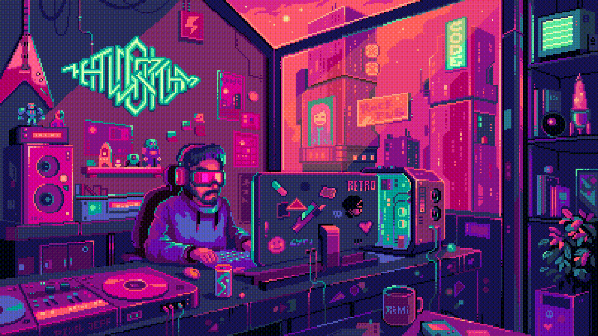
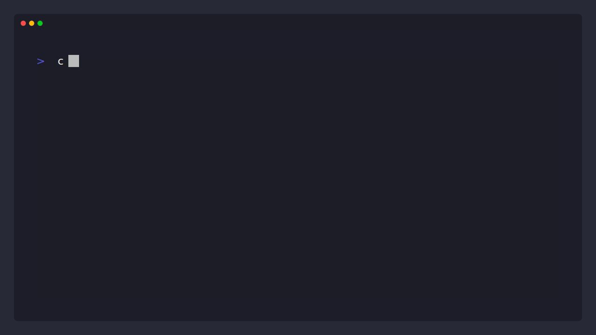

 

---

## 💫 About Me

🔭 **Currently working on:** turning raw data into actionable insight — and models into decisions.

📈 **Currently exploring:** the intersection of Machine Learning and Quantitative Finance — deep hedging, volatility modeling, and market microstructure.

👯 **Open to collaborating on:** analytics pipelines, predictive modeling, and quant/ML research projects.

💬 **Ask me about:** data storytelling, Python vs. R, dashboard design, or why volatility models are secretly beautiful.

⚡ **Fun fact:** the first "data analyst" may have been Florence Nightingale\
— she used data visualization in the 1850s to save lives.

 

## 🧭 Two Sides of the Same Dataset

| 📊 As a Data Scientist | 📈 As a Quant Enthusiast |
|:---|:---|
| Turns messy data into clean pipelines | Turns market noise into signal |
| Fluent in `pandas`, `ggplot2`, SQL joins | Fluent in Monte Carlo & Black-Scholes |
| Believes in EDA before modeling | Believes in backtests before beliefs |
| Dashboard therapist (Power BI / Tableau) | Risk-management realist |

---

### `> under the hood.`

**Data, Analytics & BI:**

**Data Engineering & Cloud:**

**Workflow:**

---

### 📌 Featured Project

> #### 🗂️ [Data Science & Quantitative Finance Portfolio](https://github.com/Sanaurrehmanarain/sana-data-science-portfolio)
> A single index of every project I've built — Deep Learning, Machine Learning, Quant Finance, SQL, and R — each linked to its own repo with full code and documentation. **Start here for the full picture.**

---

### `> git status.`

---

### ✍️ Random Dev Quote

---

### `> reach out.`

💜 If you liked what you saw and love data, deadlines, and dashboards even half as much as I do, let's connect.

